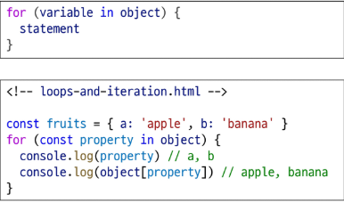
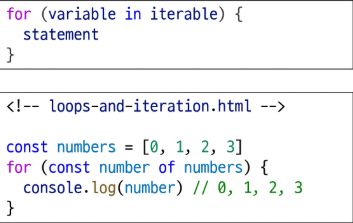
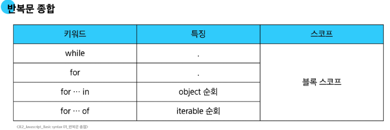

# 연산자 종류
- 할당 연산자
    - 오른쪽에 있는 피연산자의 평가 결과를 왼쪽 피연산자에 할당하는 연산자
    - ex) a += 10
- 증가 & 감소 연산자
    - 증가 연산자(++)
        - 피연산자를 증가 시키고 연산자의 위치에 따라 증가하니 전이나 후의 값을 반환
    - 감소 연산자(--)
        - 피연산자를 감소 시키고 연산자의 위치에 따라 감소하기 전이나 후의 값을 반환
- 비교 연산자
    - 피연산자들을 비교하고 결과 값을 boolean으로 반환하는 연산자
        - '>' , '<'
- 동등 연산자
    - ==
    - 두 피연산자가 같은 값으로 평가되는지 비교한 후 boolean 값을 반환
    - 암묵적 타입 변환 통해 타입을 일치시킨 후 값은 값인지 비교
    - 두 피연산자가 모두 객체일 경우 메모리의 같은 객체를 바라보는지 판별
- 일치 연산자
    - ===
    - 두 피연산자의 값과 타입이 모두 같은 경우 true를 반환
    - 같은 객체를 가리키거나, 같은 타입이면서 같은 값인지를 비교
    - 엄격한 비교가 이뤄지며 암묵적 타입 변환이 발생하지 않음
    - 특별한 경우를 제외하고는, 예측하지 못한 결과를 방지하기 위해 사용을 권장
- 논리 연산자
    - and 연산
        - &&
    - or 연산
        - ||
    - not 연산
        - !
    - 단축 평가 지원

# 조건문
- if : 조건 표현식의 결과값을 boolean 타입으로 변환 후 참/거짓을 판단
## 삼항 연산자
- 간단한 조건부 로직을 간결하게 표현할 때 유용
- 복잡한 로직이나 대다수의 경우에는 가독성이 떨어질 수 있으므로 적절한 상황에서만 사용할 것
- condition
    - 평가할 조건 (true 또는 false로 평가)
- expression1
    - 조건이 true일 경우 반환할 값 또는 표현식
- expression2
    - 조건이 false일 경우 반환할 값 또는 표현식

# 반복문
- while , for, for ..in, for .. of
## while
- 조건문이 참이면 문장을 계속해서 수행
## for
- 특정한 조건이 거짓으로 판별 될 때까지 반복
## for ... in
- 객체의 열거 가능한(enumerable)속성의 키에 대해 반복

## for ... of
- 반복 가능한 객체의 값에 대해 반복

## 두 개 모습

# 배열 반복과 for ... in
- 객체의 관점에서 보면, 배열의 인덱스도 '정수 형태의 이름을 가진 열거 가능한 속성'
- for ...in은 정수가 아닌 이름과 속성을 포함하여 열거 가능한 모든 속성을 반환
- 내부적으로 for ...in은 배열의 반복자가 아닌 속성 열거를 사용하기 때문에 특정 순서에 따라 인덱스를 반환하는 것을 보장할 수 없음
- 배열에서는 for문, for ... of 를 사용

# 반복문 사용 시 const 사용 여부
- for문
    - for (let i=0 , i < arr.length;, i++){...}의 경우에는 최초 정의한 i를 재할당 하면서 사용하기 때문에 const를 사용하면 에러 발생

- for...in, for ...of
    - 재할당이 아니라, 매 반복마다 다른 속성 이름이 변수에 저장되는 것이므로 const를 사용해도 에러가 발생 안함
    - 단, const특징에 따라 블록 내부에서 변수를 수정할 수 없음
## 반복문 종합
