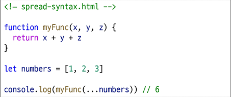
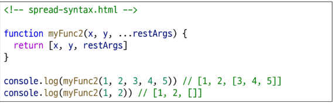
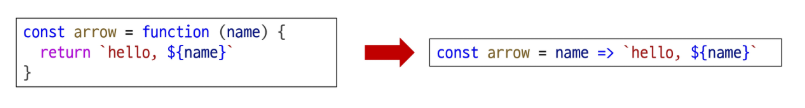
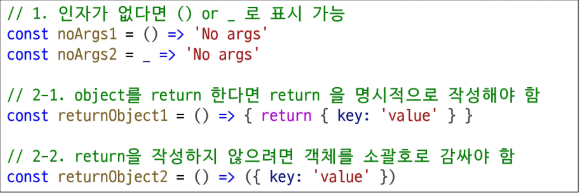

# Spread syntax
- 전개 구문
- 배열이나 문자열처럼 반복 가능한(iterable) 항목들을 개별 요소로 펼치는 것
- 전개 대상에 따라 역할이 다름
## 전개 구문 활용처
1. 함수와의 사용
    - 함수 호출시 인자 확장
    - 나머지 매개변수 (압축)
2. 객체와의 사용
3. 배열과의 활용

## 전개 구문 활용
- 함수와의 사용
    1. 인자 확장 (함수 호출 시)
    
    2. 나머지 매개변수 (압축)
    

# 화살표 함수 표현식

1. function 키워드 제거 후 매개변수와 중괄호 사이에 화살표( => ) 작성
2. 함수의 매개변수가 하나 뿐이라면, 매개변수의 '()' 제거 가능 ( 단, 생략하지 않는것을 권장)
3. 함수 본문의 표현식이 한 줄이라면, '{}' 와 'return' 제거 가능
## 화살표 함수 심화
