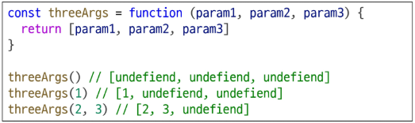
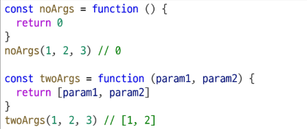

# Function
- 참조 자료형에 속하며 모든 함수는 Function object

# 함수 구조
- function 키워드
- 함수의 이름
- 함수의 매개변수
- 함수의 body를 구성하는 statements
- return 문이 없거나 return 뒤에 값이 없으면, 함수는 undefined를 반환합니다

# 함수 선언식 특징
- 호이스팅 됨
- 코드의 구조와 가독성 면에서는 표현식에 비해 장점이 있음

# 함수 표현식 특징
- 호이스팅 되지 않음
    - 변수 선언만 호이스팅되고 함수 할당은 실행 시점에 이루어짐
# 함수 표현식 사용을 권장하는 이유
- 예측 가능성
    - 호이스팅의 영향을 받지 않아 코드 실행 흐름을 더 명확하게 예측할 수 있음
- 유연성
    - 변수에 할당되므로 함수를 값으로 다루기 쉬움
- 스코프 관리
    - 블록 스코프를 가지는 let이나 const와 함께 사용하여 더 염격한 스코프 관리가 가능

# 매개변수 정의 방법
1. 기본 함수 매개 변수
    - 함수 호출 시 인자를 전달하지 않거나 undefined를 전달할 경우, 지정된 기본값으로 매개변수를 초기화
2. 나머지 매개 변수
    - 정해지지 않은 개수의 인자들을 배열로 모아서 받는 방법
    - 작성 규칙
        - 함수 정의 시 나머지 매개변수는 하나만 작성할 수 있음
        - 나머지 매개변수는 함수 정의에서 매개변수 마지막에 위치해야 함

# 매갭녀수와 인자 개수가 불일치 할 때
- 매개변수 개수 > 인자 개수
- 누락된 인자는 undefined로 할당

- 매개변수 개수 < 인자 개수
- 초과 입력한 인자는 사용하지 않음
