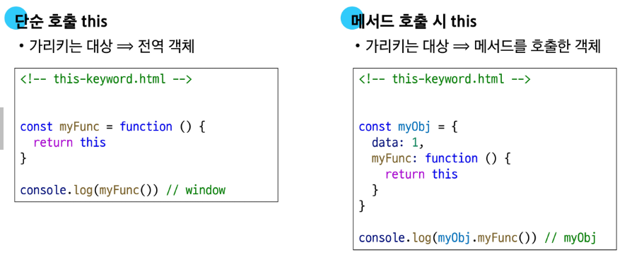

# Object

- 키로 구분된 데이터 집합을 저장하는 자료형

# 객체 구조

- 중괄호('{}')를 이용해 작성
- 중괄호 안에는 key:value 쌍으로 구성된 속성(property)를 여러 개 작성 가능
- key는 문자형만 허용
- value는 모든 자료형 허용

# 속성 참조

- 점('.')표기법 또는 대괄호('[]')표기법으로 객체 속성에 접근
- key 이름에 띄어쓰기 같은 구분자가 있으면 대괄호 접근만 가능

# 'In'연산자

- 속성이 객체에 존재하는지 여부를 확인
- 객체의 키나 배열의 인덱스 존재 여부를 확인하는 연산자

# Method

- 객체 속성에 정의된 함수

# Method 기본 문법

- 메서드도 값이 함수인 속성
- 메서드와 일반 함수의 차이는 ?
  - 메서드는 자신이 속한 객체의 다른 속성들에 접근할 수 있음
  - 이를 위한 방법이 this

# Method

- 객체 속성에 정의된 함수
- this 키워드를 사용해 객체 자신의 속성이나 메서드에 접근하여 특정 작업을 수행 할 수 있음

# this

- 함수나 메서드를 호출한 객체를 가리키는 키워드

# JavaScript에서 this는 함수를 호출하는 방법에 따라 가리키는 대상이 달라짐

- 일반 함수에서의 단순 호출
  - 전역 객체
- 객체에서의 메서드 호출
  - 메서드를 호출한 객체
    

# 중첩된 함수에서의 this 문제점

- forEach의 인자로 작성된 함수는 일반적인 함수 호출이기 때문에 this가 전역 객체를 가리킴

# 해결책

- 화살표 함수는 자신만의 this를 가지지 않음
- 따라서 외부 함수(myFunc)에서의 this 값을 가져옴

# JavaScript 'this' 정리

- JavaScript의 함수는 호출될 때 this를 암묵적으로 전달 받음
- JavaScript에서 this는 함수가 호출되는 방식에 따라 결정되는 현재 객체를 나타냄
- Python의 self와 Java의 this가 선언 시점에 이미 값이 정해지는 것과 달리 JavaScript의 this는 함수가 호출될 때 동적으로 결정
- 장점
  - 함수(메서드)를 하나만 만들어 여러 객체가 공유하여 각자 자신의 데이터로 동작하게 할 수 있음
- 단점
  - 이런 유연함이 실수로 이어질 수 있다는 것

# 추가 객체 문법

1. 단축 속성
   - 키 이름과 값으로 쓰이는 변수의 이름이 같은 경우 단축 구문을 사용할 수 있음
2. 단축 메서드
   - 메서드 선언 시 function 키워드 생략 가능
3. 계산된 속성(computed property name)
   - 키가 대괄호([])로 둘러싸여 있는 속성
4. 구조 분해 할당(destructing assignment)
   - 배열 또는 객체를 분해하여 객체 속성을 변수에 쉽게 할당할 수 있는 문법
   - 함수의 매개변수로 객체 구조 분해 할당 활용 가능
5. 객체와 전개 구문(Spread Syntax)
   - 객체 복사
     - 객체 내부에서 객체 전개
   - 얕은 복사에 활용 가능
6. Object keys() / values() / entries()
   - 유용한 객체 메서드
     - Object.keys()
       - Object의 key 값들을 리스트로 반환
     - Object.values()
       - Object의 value값들을 리스트로 반환
     - Object.entries()
       - Object의 key와 value 값들을 한 쌍으로 묶은 리스트로 반환
7. Optional chaining('?.')
   - 속성이 없는 중첩 객체에 접근하려 할 때 에러 발생 없이 안전하게 접근하는 방법
   - 만약 참조 대상이 null 또는 undefined라면 에러가 발생하는 것 대신 평가를 멈추고 undefined를 반환
   - Optional chaining('?.') 장점
     - 참조가 누락될 가능성이 있는 경우 연결된 속성으로 접근할 때 더 짧고 간단한 표현식을 작성할 수 있음
     - 어떤 속성이 필요한지에 대한 보증이 확실하지 않는 경우에 객체의 내용을 보다 편리하게 탐색할 수 있음
     - 만약 Optional chaining을 사용하지 않는다면 다음과 같이 '&&'연산자를 사용해야 함
   - Optional chaining('?.') 주의 사항
     1. Optional chaining은 존재하지 않아도 괜찮은 대상에만 사용해야 함(남용 X)
        - 왼쪽 평가대상이 없어도 괜찮을 경우에만 선택적으로 사용
        - 중첩 객체를 에러 없이 접근하는 것이 사용 목적이기 때문
     2. Optional chaining 앞의 변수는 반드시 선언되어 있어야 함
   - Optional chaining('?.') 정리
     1. obj?.prop
        - obj가 존재하면 obj.prop을 반환하고, 그렇지 않으면 undefined를 반환
     2. obj?.[prop]
        - obj가 존재하면 obj[prop]을 반환하고, 그렇지 않으면 undefined를 반환
     3. obj?.method()
        - obj가 존재하면 obj.method()를 호출하고, 그렇지 않으면 undefined를 반환
