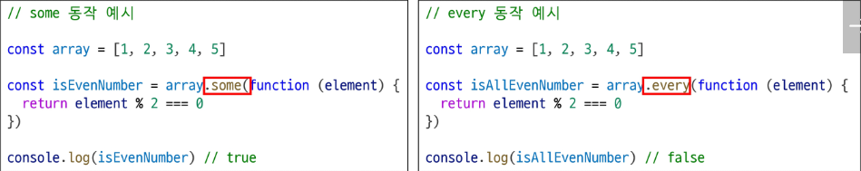
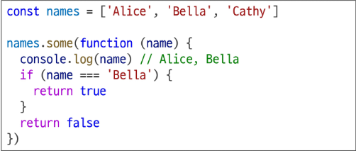
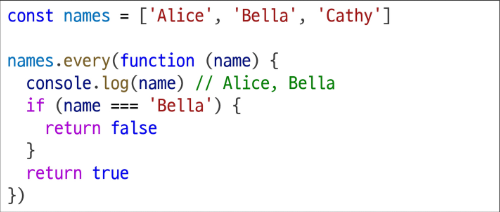

# forEach에서 break 사용하기

- forEach에서는 break 키워드를 사용할 수 없음
- 대신 some과 every의 특징을 활용해 마치 break를 사용하는 것처럼 활용 할 수 있음
  

# forEach에서 break 하는 대안

- some을 활용한 예시

  - 콜백 함수가 true를 반환하면 즉시 순회를 중단하는 특징을 활용
    

- every를 활용한 예시
  - 콜백 함수가 false를 반환하면 즉시 순회를 중단하는 특징을 활용
    

# 배열은 객체다

- 배열도 키와 속성들을 담고 있는 참조 타입의 객체
- 배열의 요소를 대괄호 접근법을 사용해 접근하는 건 객체 문법과 같음
  - 배열의 키는 숫자
- 숫자형 키를 사용해 객체의 기본 기능 외로 '순서가 있는 컬렉션'을 제어하는 특별한 메서드를 제공
- 배열은 인덱스를 키로 가지며 length 속성을 갖는 특수한 객체
