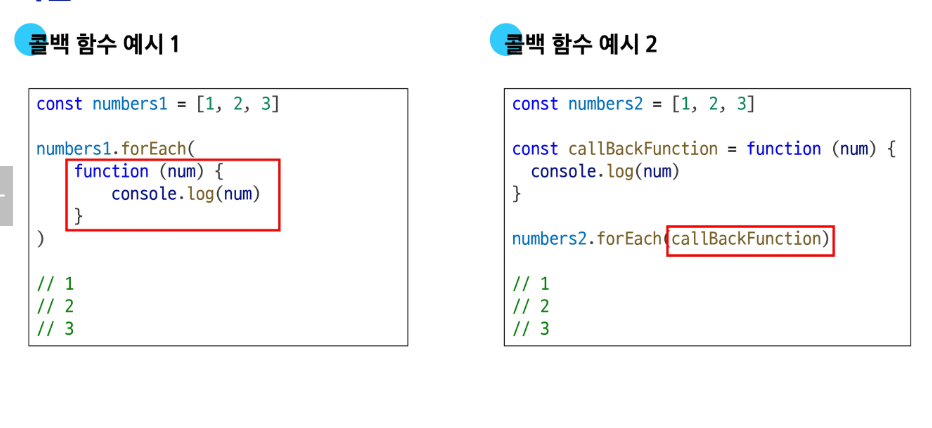
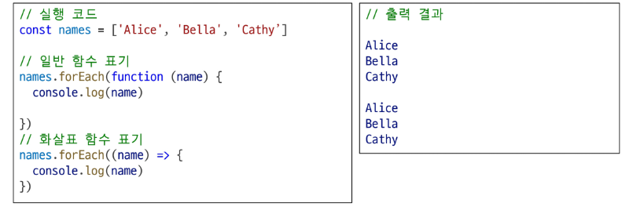
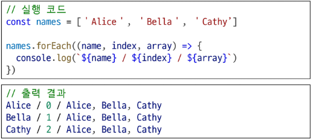
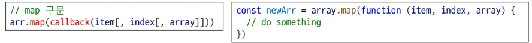
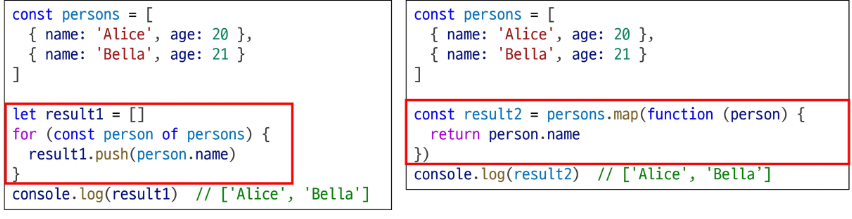
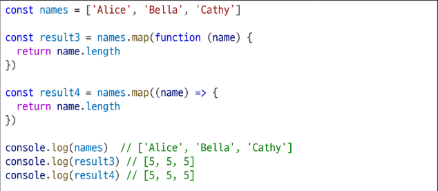
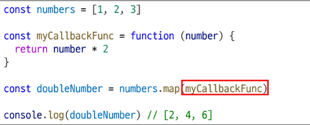
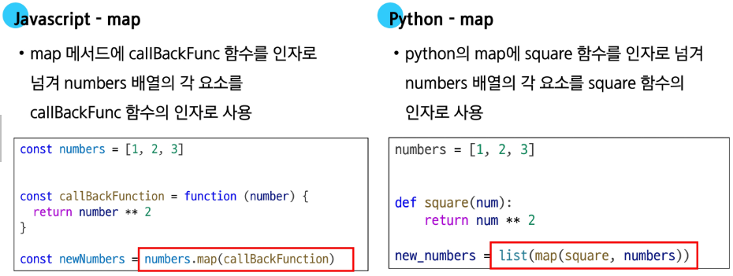
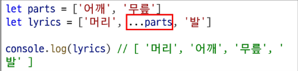

# 콜백 함수

- 다른 함수에 인자로 전달되는 함수
- 예시
  - 

## 콜백 함수의 이점

- 함수 유연성 측면
  - 함수를 호출하는 코드에서 콜백 함수의 동작을 자유롭게 변경할 수 있음
  - map 함수는 동일하지만, 어떤 '콜백함수'를 전달하느냐에 따라 결과가 다라짐
- 비동기적 측면
  - setTimeout 함수는 콜백 함수를 인자로 받아 일정 시간이 지난 후에 실행됨
  - 이때, setTimeout 함수는 비동기적으로 콜백 함수를 실행하므로, 다른 코드의 실행을 방해하지 않음

## 주요 Array Helper Methods

- forEach
  - 배열 내의 모든 요소 각각에 대해 함수를 호출
  - 반환 값 없음
- map
  - 배열 내의 모든 요소 각각에 대해 함수를 호출
  - 함수 호출 결과를 모아 새로운 배열을 반환

## forEach()

- 구조

```JavaScript
arr.forEach(callback(item[, index[, array]]))

arr.forEach(function(item, index, array){

})
```

- 콜백함수는 3가지 매개변수로 구성
  - item : 처리할 배열의 요소
  - index : 처리할 배열 요소의 인덱스 (선택 인자)
  - array : forEach를 호출한 배열 (선택 인자)
- 반환 값
  - undefined

## forEach 예시

- 동일한 결과를 만들어 냄
- 간단한 콜백 함수의 경우, 화살표 함수를 사용하는 것이 가독성, this를 다루는 방식의 차이가 있으므로 가능한 화살표 함수 사용이 권장
  

## forEach 활용

- forEach는 항상 undefined를 반환
- break 문으로 반복을 중단할 수 없음
- 간결한 코드를 위해서 필요한 매개변수만 활용
  

# map()

- 배열의 모든 요소에 대해 함수(콜백 함수)를 호출하고, 반환 된 호출 결과 값을 모아 새로운 배열을 반환
- 구조
  - 
- forEach의 매개 벼너수와 동일
- 반환 값
  - 배열의 각 요소에 대해 실행한 callback의 결과를 모은 새로운 배열
  - forEach 동작 원리와 같지만 forEach와 달리 새로운 배열을 반환함

# map() 예시

- 배열을 순회하며 각 객체의 name 속성 값을 추출하기 (for ...of 와 비교)
- map()은 배열 반환 이라는 의도가 명확히 나타나, for 문보다 코드가 가녁ㄹ하고 직관적
- map()은 새로운 배열을 반환하므로, 다른 메서드를 체이닝할 수 있음
  

## map 활용

- 화살표 함수를 활용해 간결하게 활용할 수 있음
- 원본 배열(names)를 변경하지 않고, 항상 새로운 배열을 반환(불변성)
  
- 커스텀 콜백 함수 활용
  - 콜백 함수를 변수에 담아두면, map 외 다른 곳에서도 같은 로직을 할 수 있어 유용
- myCallbackFunc()가 아닌 myCallbackFunc를 전달
  



# 배열 순회 정리

- for loop
  - 배열의 인덱스를 이용하여 각 요소에 접근
  - break, continue 사용 가능
- for ... of
  - 배열 요소에 바로 접근 가능
  - break, continue 사용 가능
- forEach()
  - 간결하고 가독성이 높은
  - callback 함수를 이용하여 각 요소를 조작하기 용이
  - break, continue 사용 불가
  - 사용 권장

# 기타 Array Helper Methods

- filter
  - 콜백 함수의 반환 값이 참이 요소들만 모아서 새로운 배열을 반환
- find
  - 콜백 함수의 반환 값이 참이면 해당 요소를 반환
- some
  - 배열의 요소 중 적어도 하나라도 콜백 함수를 통과하면 true를 반환하며 즉시 배열 순회 중지 반면에 모두 통과하지 못하면 false 반환
- every
  - 배열의 모든 요소가 콜백 함수를 통과하면 true를 반환 반면에 하나라도 통과하지 못하면 즉시 false를 반환하고 배열 순회 중지

# 배열 with '전개 구문'

- '...'은 배열의 괄호를 없애고 내용물만 꺼내기 때문에, 배열을 합치거나 중간에 삽입할 때 유용
- 전개 구문은 항상 새로운 배열을 만듭니다. 원본 배열은 전혀 변경되지 않음
- 배열 안의 객체는 데이터가 아닌, 주소값만 복사됩니다. 복사본의 객체를 수정하면 원본도 바뀜
  
