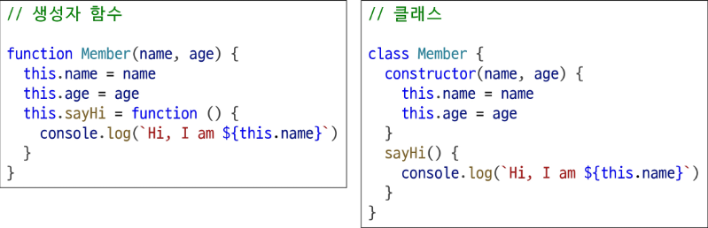

# 클래스

- 객체를 생성하기 위한 템플릿

# 클래스 기본 문법

1. class 키워드
   - 객체의 설계도인 클래스를 정의하기 위해 사용하는 예약어
   - 호이스팅 되지만, 선언 전에 접근하면 에러가 발생합니다 (TDZ)
2. 클래스 이름
   - 일반적으로 파스칼 케이스(PascalCase)로 작성
   - 함수처럼 이름을 생략한 '익명 클래스 표현식'으로 작성하는 것도 가능
3. 생성자 메서드
   - new로 객체 생성 시 자동으로 호출되며, 속성 값의 초기 설정을 담당
   - constructor라는 이름을 가진 메서드가 단 하나만 존재할 수 있음

# 클래스 특징

- ES6에서 도입
- 생성자 함수를 사용하던 기존의 객체 생성 방식을 더 명확하고 객체 지향적으로 표현하기 위해 도입
- 그래서 클래스는 내부적으로 생성자 함수를 기반으로 동작함
  

# 클래스 활용

- new 키워드는 새 객체를 만들고, constructor를 호출하여 초기 속성 값을 설정
- 메서드 안의 this는 메서드를 호출한 member3 자신을 가리킴
  

## new 연산자

- const instance = new ClassName(arg1, arg2)
- 클래스나 생성자 함수를 사용하여 새로운 객체를 생성
