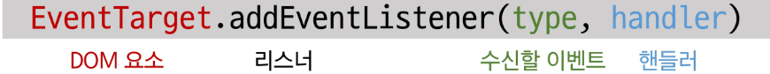
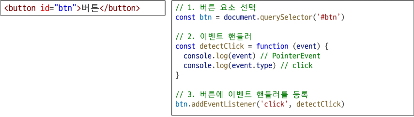
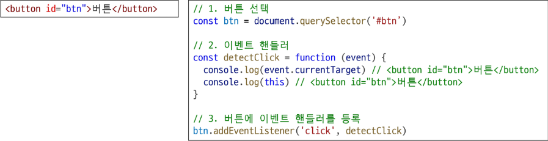

# event

- 웹 페이지 상에서 무언가 일어났다는 신호 또는 사건

## DOM요소와 이빈트

- 모든 DOM 요소는 다양한 형태의 이벤트를 발생시킬 수 있음

## event object

- DOM에서 이벤트가 발생하면, 브라우저는 해당 이벤트에 관한 정보를 담은 event object를 자동으로 생성
- 이벤트 종류
  - mouse
  - input
  - keyboard

## DOM 요소에서 event가 발생하면, 해당 event는 연결된 이벤트 처리기에 의해 처리 됨

# event handler

- 특정 이벤트가 발생했을 때 실행되는 (콜백)함수

# .addEventListener()

- 특정 DOM 요소에, 지정한 이벤트가 발생했을 때 실행할 이벤트 핸들러를 등록하는 메서드

## .addEventListener() 예시

- handleClick 함수가 이벤트 핸들러이며, button.addEventListener()는 그 핸들러를 click 이벤트에 연결해주는 역할

## 이벤트 등록(addEventListener)

- DOM 요소 : HTML 문서의 각 태그를 하나의 객체로 변환한 것
- 수신할 일벤트 : 무언가 일어났다는 신호 또는 사건
- 핸들러 : 특정 이벤트가 발생했을 때 실행되는 (콜백)함수
- 

## addEventListener 구조

- 메서드 구문
  - .addEventListener(type, handler)
- type
  - 수신할 이벤트 유형
  - 문자열로 작성(ex. 'click', 'mouseover')
- handler
  - 이벤트 발생 시 호출되는 콜백 함수
  - 자동으로 event 객체를 첫번째 매개변수로 받음
  - 반환 값 없음

# 이벤트 객체 전달

- 이벤트 발생 시, 이벤트 객체는 자동으로 이벤트 핸들러 함수에 인자로 전달됨
- 핸들러 함수는 이 인자를 통해 이벤트에 대한 상세 정보(이벤트 발생 요소, 이벤트 타입, 추가 데이터 등)에 접근하고 적절한 동작을 수행
  

## 이벤트 핸들러에서의 this

- 일반 함수를 핸들러로 사용 시, this는 이벤트 리스너가 연결된 요소를 가리킴(event 객체의 currentTarget 속성 값과 동일)
  
