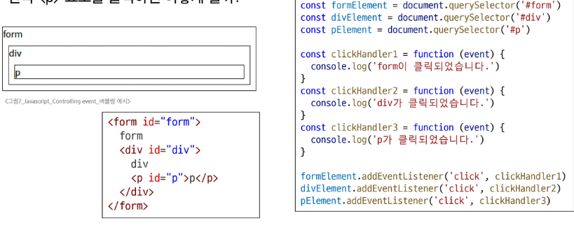
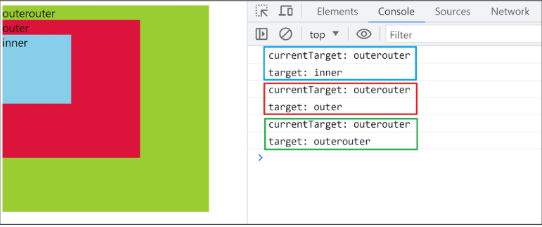
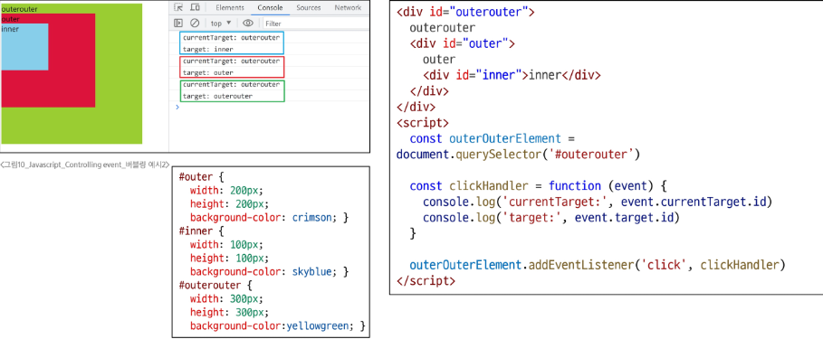
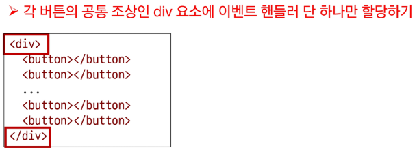
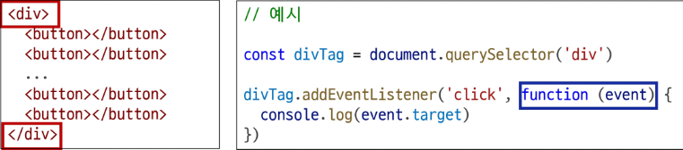

# 버블링 개요(1/2)

- form > div > p 형태의 중첩된 구조에 각각 이벤트 핸들러가 연결되어 있을 때, 만약 `
` 요소를 클릭하면 어떻게 될까?
  

# 버블링 개요(2/2)

- `
` 요소만 클릭했는데도 불구하고 모든 핸들러가 동작함
- 왜 p만을 클릭했는데 부모 요소 `
`와 `<form>`에 할당된 핸들러까지 동작할까?
  

# 버블링

- 한 요소에 이벤트가 발생하면, 해당 요소의 핸들러가 동작한 후 이어서 부모 요소의 핸들러가 동작하는 현상
- 가장 최상단의 조상 요소(document)를 만날 때까지 이 과정이 반복되면서 요소 각각에 할당된 핸들러가 동작

# 이벤트가 정확히 어디서 발생했는지 접근할 수 있는 방법

1. event.currentTarget
   - '현재'요소
   - 항상 이벤트 핸들러가 연결된 요소만을 참조하는 속성
   - 'this'와 같음
2. event.target
   - 이벤트가 발생한 가장 안쪽의 요소(target)를 참조하는 속성
   - 실제 이벤트가 시작된 요소
   - 버블링이 진행 되어도 변하지 않음

# target & currentTarget 예시(1/3)

- 세 요소 중 가장 최상위 요소인 outerouter 요소에만 핸들러가 연결
- 각 요소를 클릭 했을 때 event의 target과 currentTarget의 차이 비교
  

# target & currentTarget 예시(2/3)

- 핸들러는 outerouter에만 연결되어 있지만, 하위 요소 outer와 inner를 클릭해도 해당 핸들러가 동작함
- 클릭 이벤트가 어디서 발생했든 상관없이 outerouter까지 이벤트가 버블링 되어 핸들러를 실행시키기 때문
  

# target & currentTarget 예시(3/3)

# 캡처링(capturing)

- 이벤트가 최상위 조상에서 타겟 요소까지 하위로 전파되는 단계 (버블링과 반대)
- table의 하위 요소 td를 클릭하면, 이벤트는 먼저 최상위 요소부터 아래로 전파됨(캡처링)
- 실제 이벤트가 발생한 지점(event.target)에서 실행된 후 다시 위로 전파(버블링)

# 버블링이 필요한 이유 (1/2)

- 만약 다음과 같이 각자 다른 동작을 수행하는 버튼이 여러 개가 있다고 가정하면, 각 버튼마다 서로 다른 이벤트 핸들러를 등록해야 할까?
  

# 버블링이 필요한 이유 (2/2)

- 요소들의 공통 조상에 이벤트 핸들러를 하나만 등록하면, 여러 자식 요소에서 발생하는 이벤트를 한곳에서 효율적으로 다룰 수 있음
- 공통 조상(div)에 할당한 핸들러에서 event.target을 이용하면 실제 어떤 버튼에서 이벤트가 발생했는지 알 수 있기 때문
  
